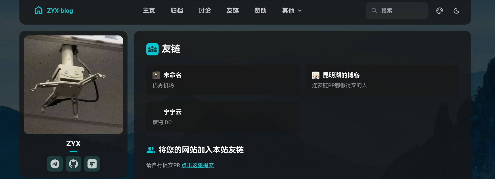

# 页面  
如 `https://xx.xx/xx` 这样的页面，一般存放在 `src/pages/xx.astro` 下  
本例以2x的友链为例  
查看 `src/pages/friends.astro` ，直接复制到自己仓库同路径里  
看astro文件开头，有段 `import`  
``` astro title="src/pages/friends.astro" {3,4}
---
import MainGridLayout from "@layouts/MainGridLayout.astro";
import { Icon } from "astro-icon/components";
import type { FriendsData } from "@/types/data";
import friendsData from "@/data/friends.json";

const { friends } = friendsData as FriendsData;
---

...
```  
注意到第三、四行引入的依赖不是fuwari自带的   
复制对应文件（ `src/types/data.ts` , `src/data/friends.json` ）到对应目录  
发现 `src/data/friends.json` 里存放友链数据，清理并留下一个示例  
```json title="src/data/friends.json"
{

  "friends": [

    {

      "name": "xxx",

      "avatar": "https://xxx.png",

      "description": "xxxx",

      "url": "https://xxx.xxx"

    }
  ]
}
```
再检查 `src/pages/friends.astro` 的html部分（---下的部分）发现有外链  
```astro title= "src/pages/friends.astro" "https://github.com/zyxisme/fuwari/edit/main/src/data/friends.json" startLineNumber=35
        	</h2>
        	<p class="text-sm text-black/60 dark:text-white/60">
        		请自行提交PR <a target="_blank" href="https://github.com/zyxisme/fuwari/edit/main/src/data/friends.json" class="transition link text-[var(--primary)] font-medium underline">点击这里提交</a>
        	</p>
        <br>
```
替换成自己的  
保存，提交，推送  
成功部署  
