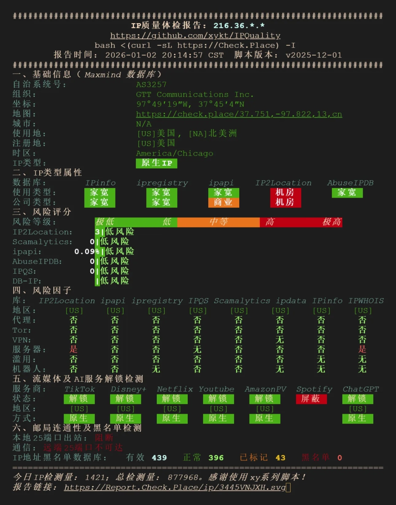
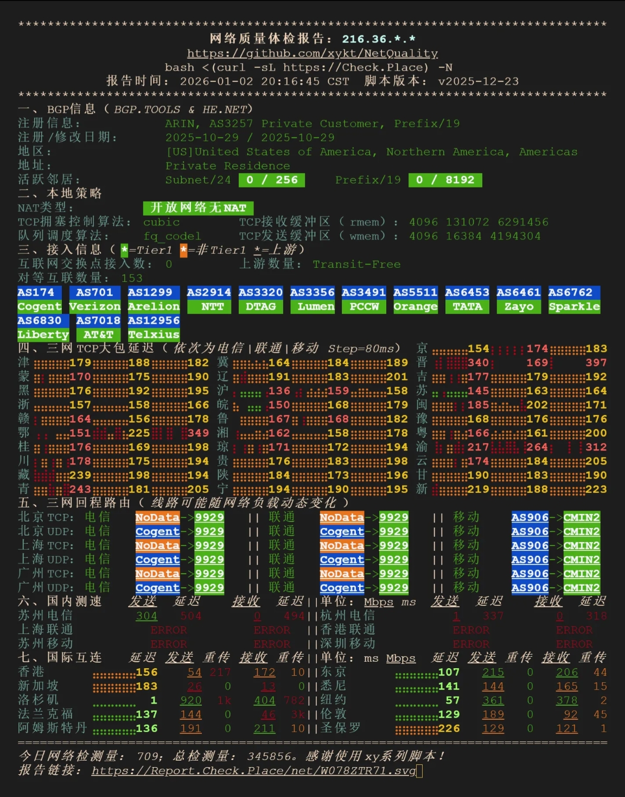
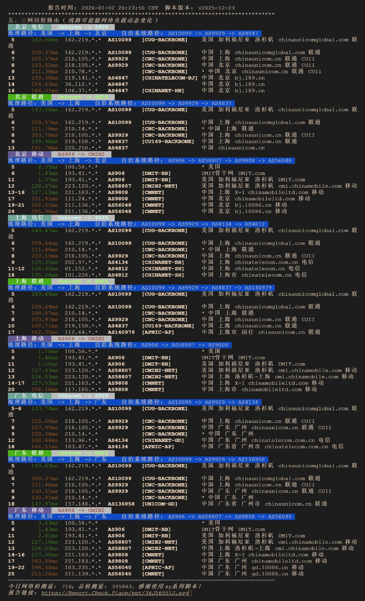

# 💻基本信息
```
Basic System Information:
---------------------------------
Uptime     : 0 days, 0 hours, 15 minutes
Processor  : Intel(R) Xeon(R) Platinum 8269CY CPU @ 2.50GHz
CPU cores  : 2 @ 2494.140 MHz
AES-NI     : ✔ Enabled
VM-x/AMD-V : ✔ Enabled
RAM        : 1.9 GiB
Swap       : 0.0 KiB
Disk       : 40.3 GiB
Distro     : Debian GNU/Linux 12 (bookworm)
Kernel     : 6.8.0-48-generic
VM Type    : KVM
IPv4/IPv6  : ✔ Online / ❌ Offline

IPv4 Network Information:
---------------------------------
ISP        : GTT Communications Inc.
ASN        : AS3257 GTT Communications Inc.
Host       : MegaPath Networks Inc.
Location   : Pleasanton, California (CA)
Country    : United States

fio Disk Speed Tests (Mixed R/W 50/50) (Partition -):
---------------------------------
Block Size | 4k            (IOPS) | 64k           (IOPS)
  ------   | ---            ----  | ----           ---- 
Read       | 20.44 MB/s    (5.1k) | 336.11 MB/s   (5.2k)
Write      | 20.46 MB/s    (5.1k) | 337.88 MB/s   (5.2k)
Total      | 40.90 MB/s   (10.2k) | 673.99 MB/s  (10.5k)
           |                      |                     
Block Size | 512k          (IOPS) | 1m            (IOPS)
  ------   | ---            ----  | ----           ---- 
Read       | 722.12 MB/s   (1.4k) | 723.55 MB/s    (706)
Write      | 760.48 MB/s   (1.4k) | 771.74 MB/s    (753)
Total      | 1.48 GB/s     (2.8k) | 1.49 GB/s     (1.4k)

Geekbench 5 Benchmark Test:
---------------------------------
Test            | Value                         
                |                               
Single Core     | 733                           
Multi Core      | 1448                          
Full Test       | https://browser.geekbench.com/v5/cpu/24014157

 SysBench CPU 测试 (Fast Mode, 1-Pass @ 5sec)
---------------------------------
 1 线程测试(单核)得分:          975 Scores
 2 线程测试(多核)得分:          2013 Scores
 SysBench 内存测试 (Fast Mode, 1-Pass @ 5sec)
---------------------------------
 单线程读测试:          19961.66 MB/s
 单线程写测试:          16339.19 MB/s
```
# 🎬IP质量
 

# 🌐网络质量
 

# 📍回程路由
 

[NodeQuality链接](https://nodequality.com/r/GQMGaZwqrlWrBKS1Sd83o6Ix41Oxw5OH)
购买链接: https://monesy.cn/cart?fid=18&gid=48