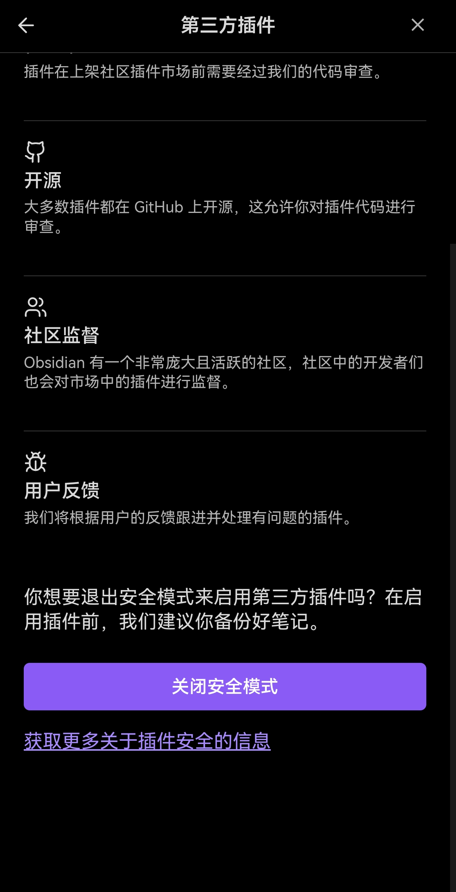
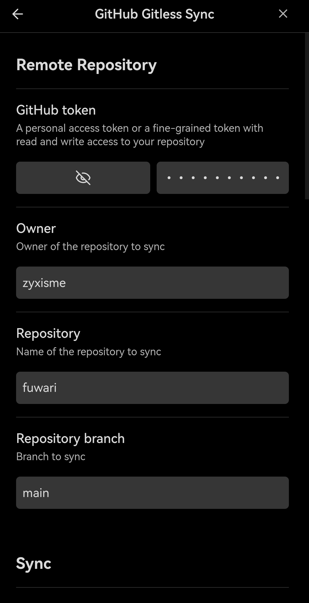
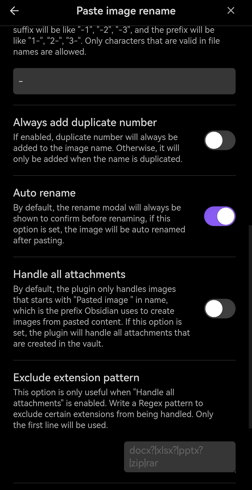
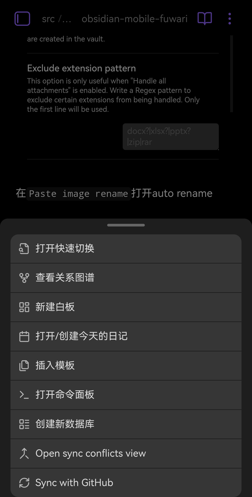
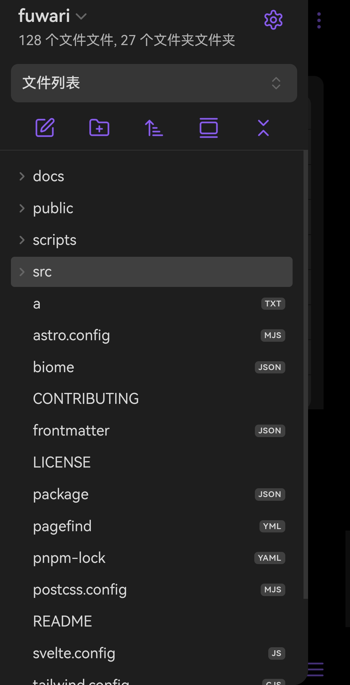

# 1. 下载Obsidian
https://obsidian.md/download

# 2. 安装插件
## 1. 关闭安全模式
在设置里找到第三方插件，关闭安全模式

## 2. 浏览社区插件市场
找到`GitHub Gitless Sync`和`Paste image rename`两个插件，安装并启用

## 3. 配置插件
在 https://github.com/settings/tokens 添加一个密钥，授予读写仓库相关权限

在`GitHub Gitless Sync`填入

在`Paste image rename`打开auto rename

# 3. 使用

点击右下角三横杠，然后sync with GitHub
配置没问题的话就能美美编辑了

