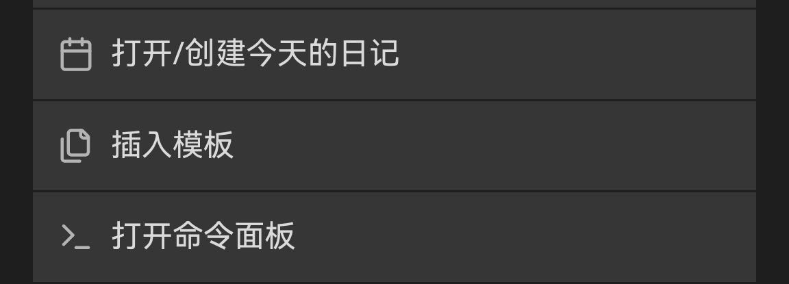

## 模板创建
在public文件夹下创建template.md  
插入以下markdown  

```markdown title="template.md"
--- 
title:
published: {{date}}T{{time}}
description: 
image: ""
tags: []
category: ""
draft: true
lang: ""
---
```

设置/模板 中配置路径为`public`，时间格式为`HH:mm:ss`  

## 模板使用
新建一个文章，菜单中选择插入模板  
  
