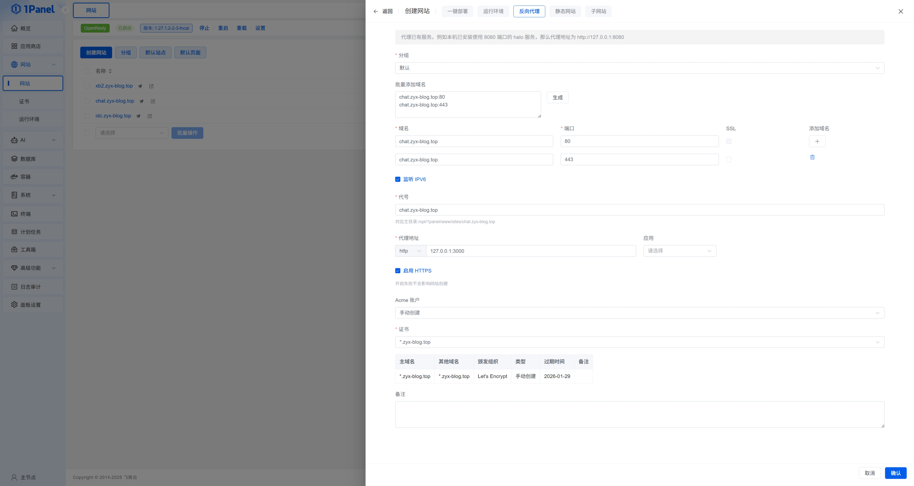
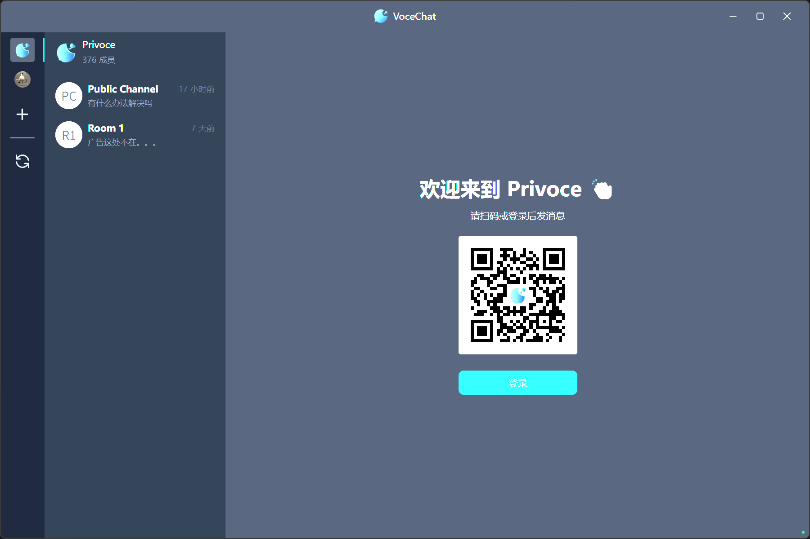
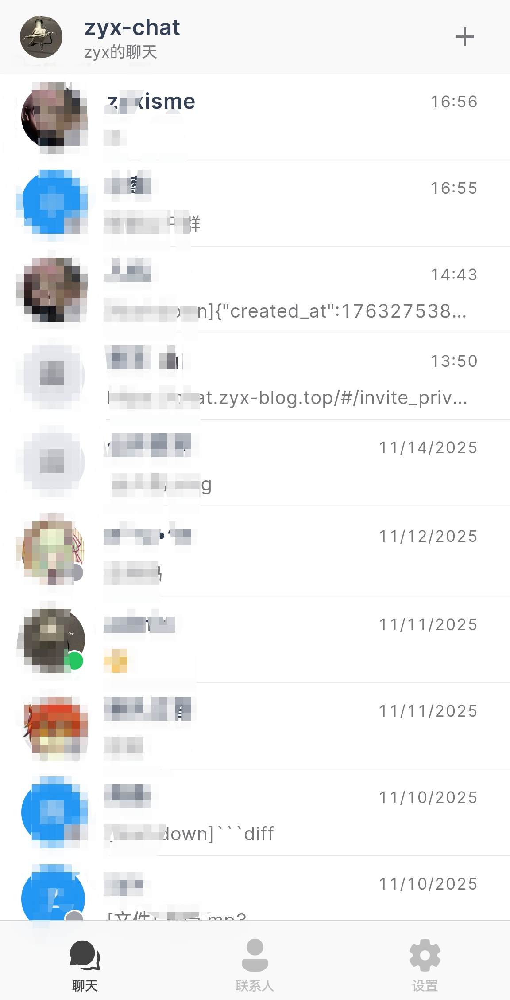

# 安装
自托管肯定要一个服务器，这里推荐一个IDC，虽然质量一般，但便宜啊[doge]  

[https://nnyunidc.cn](https://cloud.umami.is/q/L8JGF3rEb)

:::tip[需要Docker]
虽然一般来说服务器都会装docker，但以防你没装，这里有一个一键指令  

```bash
# 安装 Docker
apt update
apt install -y curl
curl -fsSL https://get.docker.com | bash
systemctl start docker
systemctl enable docker

# 关闭 & 配置防火墙
ufw disable
systemctl stop iptables
systemctl stop nftables
```

:::  

### 最简安装  
一行指令  
```bash
# 运行容器
docker run -d --restart=always \
  -p 3000:3000 \
  --name vocechat-server \
  privoce/vocechat-server:latest
```  

### 目录映射版安装

把下面 `/your/data/dir` 换成你想要映射的目录
```bash
# 运行容器
docker run -d --restart=always \
  -p 3000:3000 \
  --name vocechat-server \
  -v /your/data/dir:/home/vocechat-server/data \
  privoce/vocechat-server:latest
```  

# 使用  
理论上现在访问你服务器的3000端口就能使用了，但是https还要进一步配置  
## https配置  
这里我使用1panel
  
将域名修改为你自己的，然后自己传一个证书或者acme申请  

## 软件配置  
voce chat自定义自由度很高，这里我就不一一赘述了，详细可以查看官方文档  
https://doc.voce.chat/zh-cn/  

### bot
这个bot是我个人觉得比较有意思的，我写了一个edgeone边缘函数，比较丑陋，大家凑合看吧  
``` js
async function handleRequest(event) {

  const request = event.request;

  const body = await request.clone().text();
  
  sendmsg(body);

  console.log(body);


  if (request.headers.get('content-type')?.includes('application/json')) {

    try {

      const jsonBody = JSON.parse(body);

      handle(jsonBody);

      sendmsg("jsoned");

    } catch (e) {

      sendmsg('JSON解析失败');

    }

  }

  handle(JSON.parse(body));

  return event.respondWith(response);

}

  

function handle(msg) {

  if (msg.detail.target.uid == 8){

    if (msg.content_type == "text/plain") {

        var arg = msg.detail.content;

        var fromwho = msg.from_uid;

        if (arg == "/ping"){

          sendmsg("pong",fromwho);

          sendmsg("pong");

        };

        sendmsg("not pong");

    };

  } else {

    if (msg.content_type == "text/plain") {

        var arg = msg.detail.content;

        var fromwho = msg.from_uid;

        if (arg == "/ping"){

          sendmsg("pong",fromwho);

        };

    };

  }

  

}

  

function sendmsg(data,uid=1) {

   const url="https://chat.zyx-blog.top/api/bot/send_to_user/"+uid.toString();

   fetch(url, {

       method: "POST",

       headers: {

           "Content-Type": "text/markdown",

           "x-api-key":"************"

       },

       body: data,

   })

       .then((response) => {

           if (!response.ok) {

               throw new Error("Network response was not ok");

           }

           return response.json();

       })

       .then((data) => console.log("Success:", data))

       .catch((error) => console.error("Error:", error));

}

addEventListener('fetch', (event) => {

  try {

    const request = event.request;

    handleRequest(event);

    event.respondWith(new Response(body="a",init={status:200}));

    return event.respondWith(handleRequest(event));

  } catch (e) {

    return event.respondWith(new Response('Error thrown ' + e.message));

  }

});
``` 
>[!TIP]
>记得修改域名和apikey  

现在功能很简陋（指只能ping），以后尽量更新  

### 客户端app
voce chat不仅有网页版，还有客户端
  
  
客户端非常简洁，手机上比web好用很多，但对应的功能就比较少
>ps : 手机app什么时候出黑暗模式